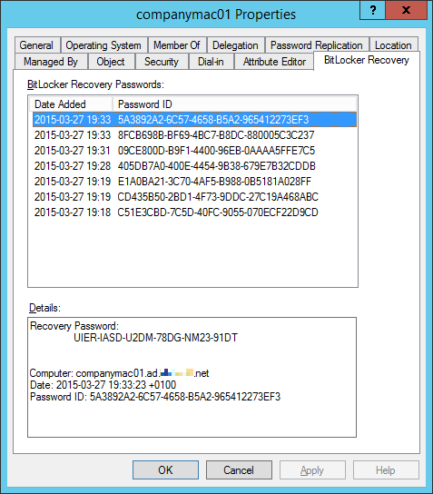

# MacLocker

## What is it

It's a utility to save FileVault recovery keys as BitLocker passwords in Active Directory

## Download

<a href="http://www.mediafire.com/download/xxir7w1c9cyldk5/maclocker-20150327.7z">MacLocker (2015-03-27)</a>

## Usage

## Result

